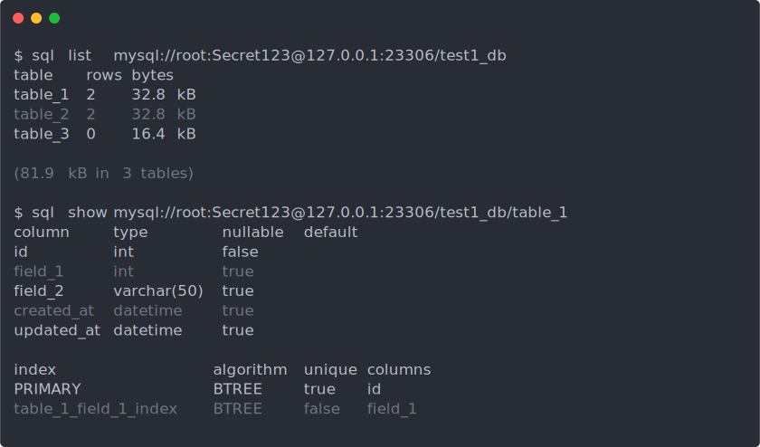
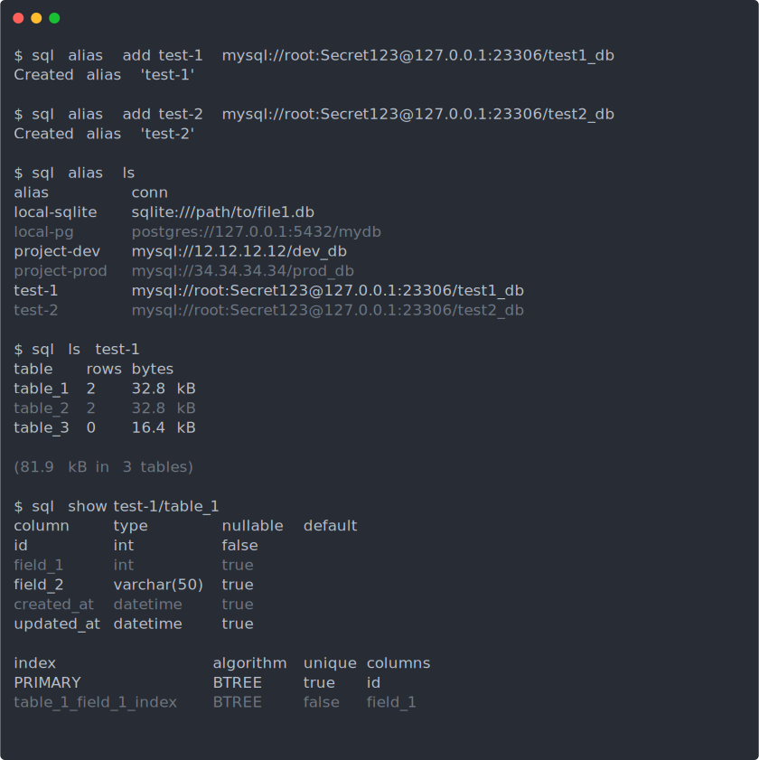
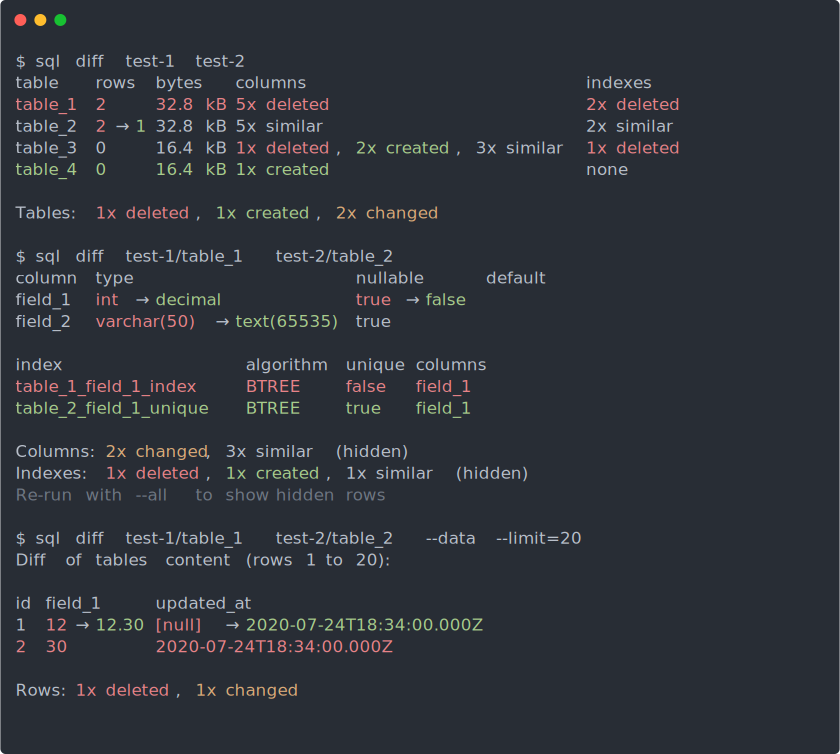
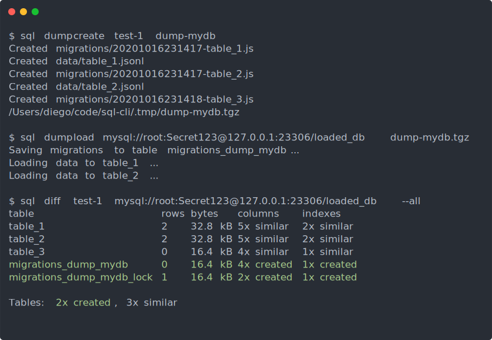
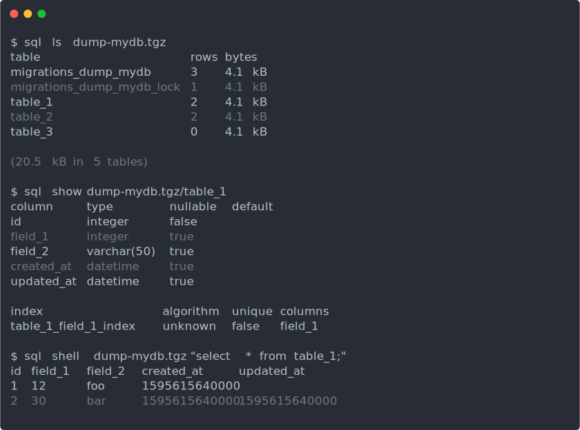

# sql-cli

Universal command-line interface for SQL databases. Built on top of [Knex](https://knexjs.org/). Supports connecting over SSH.

## Installation

Install with:

```
npm install -g @dgoguerra/sql-cli
```

## Usage

The supported commands are:

```
sql <command>

Commands:
  sql list <conn>             List tables                          [aliases: ls]
  sql show <table>            Show table structure
  sql diff <table1> <table2>  Diff two schemas or tables
  sql export <conn>           Export the connection's schema or data in XLSX
  sql open <conn>             Open in configured GUI (such as TablePlus)
  sql shell <conn>            Run REPL shell                       [aliases: sh]
  sql alias <action>          Manage saved connection aliases
  sql dump <action>           Manage connection dumps

Options:
  --client, -c  Knex client adapter                                     [string]
  --version     Show version number                                    [boolean]
  -h, --help    Show help                                              [boolean]
```

Run `sql [command] --help` to see any command usage info.

## View database contents

The `list` and `show` commands allow viewing the structure of a database.

<p align="center">
  
</p>

## Save connection aliases

Aliases can be created for known connections, and used instead of the full connection URI.

<p align="center">
  
</p>

## Diff databases

The `diff` command allows comparing two schemas or tables, in the same or different connections.

<p align="center">
  
</p>

## Create and load dumps

Generic dumps can be created from a connection and loaded to another supported database.

<p align="center">
  
</p>

A dump file can also be accessed as a database. It will be loaded to an in-memory SQLite database, where it can be queried as a database.

<p align="center">
  
</p>
